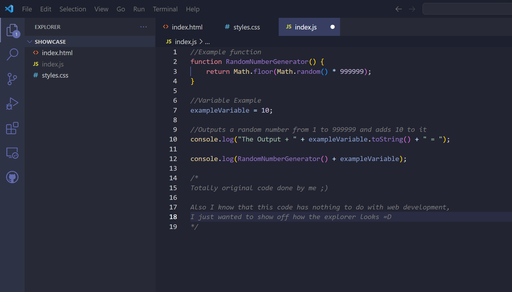
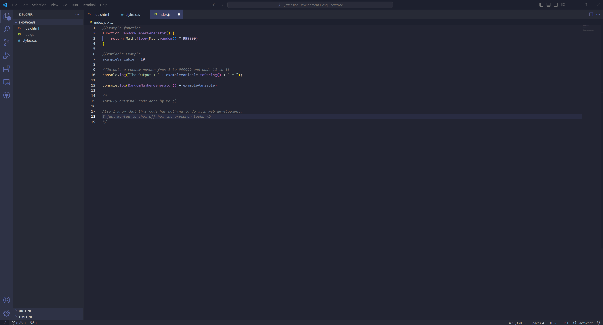

# Contemporary-Dark v1.0.1

### Github Repo

[Contemporary-Dark Repository](https://github.com/Alex-Banos/Contemporary-Dark)

## Preview

## Whats New?

See all changes on the public [GitHub Repo](https://github.com/Alex-Banos/Contemporary-Dark).

## Installation Information

Open VSCode and tap the install button.  Thats it.

## Other

### Creator Links

[Github](https://github.com/Alex-Banos)

### License

N/A

